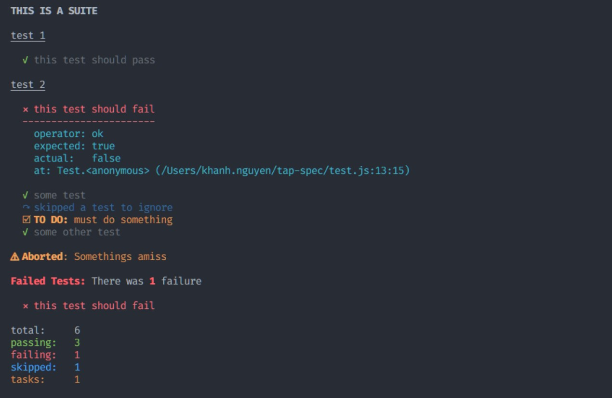

# tapfmt

A standalone command line application for formatting raw [TAP](https://testanything.org) results into pretty/readable output.

## Example Usage

Consider a file (or stdout) with the following content:

_Source: example.txt:_
```txt
TAP version 13
# THIS IS A SUITE
# test 1
ok 1 this test should pass
Bail out! Somethings amiss
# test 2
not ok 2 this test should fail
  ---
    operator: ok
    expected: true
    actual:   false
    at: Test.<anonymous> (/Users/khanh.nguyen/tap-spec/test.js:13:15)
  ...
ok 3 some test
not ok 4 # skip a test to ignore
ok 5 # todo must do something
ok 6 some other test
1..6
```

**_Command:_**

```bash
cat example.txt | tapfmt
```

**_Result:_**



## Installation

Download the latest version from the [releases]() for your operating system (Windows, macOS, Linux), extract the executable, and place it in your project directory.

If you wish to use this utility globally, save the executable to a directory on your system, then add the location to your `PATH` variable.

## Pretty Formats

There are two formatting options:

- `spec` (default)
- `json`
- _Quality PR's for other styles/formats will be accepted._

To invoke a specific format, pass the `-f` flag:

```sh
cat tap_output.txt | tapfmt -f json
```

_Outputs:_
```json
{
  "version": 13,
  "summary": {
    "total": 6,
    "passed": 3,
    "failed": 1,
    "skipped": 1,
    "todo": 1,
    "expected": -1,
    "bailout": true,
    "bailout_reason": "Somethings amiss",
    "failures": [
      {
        "suite": "THIS IS A SUITE",
        "group": "test 2",
        "test_number": 2,
        "passed": false,
        "description": "this test should fail",
        "info": "operator: ok\n    expected: true\n    actual:   false\n    at: Test.\u003canonymous\u003e (/Users/khanh.nguyen/tap-spec/test.js:13:15)"
      }
    ]
  },
  "results": [
    {
      "suite": "THIS IS A SUITE",
      "group": "test 1",
      "test_number": 1,
      "passed": true,
      "description": "this test should pass"
    },
    {
      "suite": "THIS IS A SUITE",
      "group": "test 2",
      "test_number": 2,
      "passed": false,
      "description": "this test should fail",
      "info": "operator: ok\n    expected: true\n    actual:   false\n    at: Test.\u003canonymous\u003e (/Users/khanh.nguyen/tap-spec/test.js:13:15)"
    },
    {
      "suite": "THIS IS A SUITE",
      "group": "test 2",
      "test_number": 3,
      "passed": true,
      "description": "some test"
    },
    {
      "suite": "THIS IS A SUITE",
      "group": "test 2",
      "test_number": 4,
      "passed": false,
      "directive": "skip",
      "description": "a test to ignore"
    },
    {
      "suite": "THIS IS A SUITE",
      "group": "test 2",
      "test_number": 5,
      "passed": false,
      "directive": "todo",
      "description": "must do something"
    },
    {
      "suite": "THIS IS A SUITE",
      "group": "test 2",
      "test_number": 6,
      "passed": true,
      "description": "some other test"
    }
  ]
}
```

## Why another TAP formatter?

The entire point of TAP is to provide a cross-language protocol for presenting test results. Many in the open source community adopted this standard, but responded by creating runtime-specific formatters (ex: Node.js). As a result, a single cohesive model exists with a fractured landscape of formatting tools.

Some runtimes/environments don't have TAP formatters at all (ex: Deno, Go), but it's still pretty easy to produce TAP results. `tapfmt` provides a single runtime-agnostic app to provide consistent formatting for any test suite producing TAP results.

For example, [tappedout](https://github.com/coreybutler/tapped-out) provides a runtime-agnostic JavaScript test suite that generates TAP results. This allows for tests to be produced using:

```sh
node tappedout_test.js | tapfmt
```

```sh
deno run --allow-all tappedout_test.js | tapfmt
```

```sh
cat example.txt | tapfmt
```

All of these would produce pretty results.